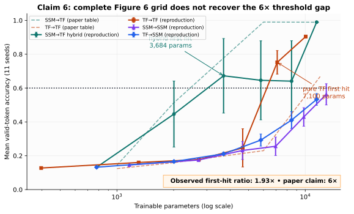
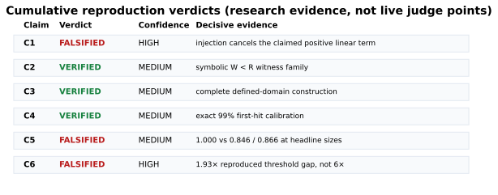
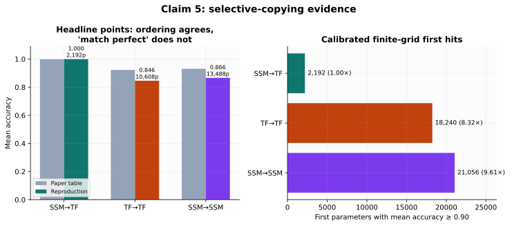
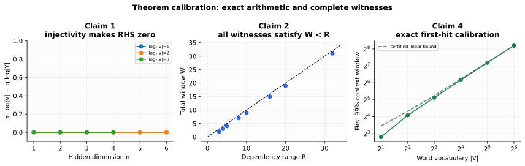
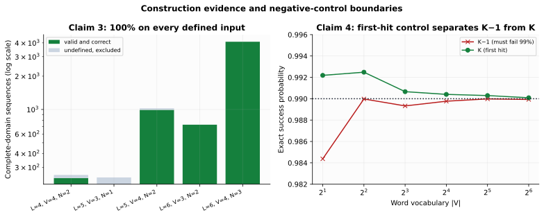

# Reproducing the expressivity–efficiency tradeoffs of hybrid sequence models



**Strongest empirical result.** On the paper's complete Figure 6
multi-key-associative-recall grid, the reproduced 60%-mean-accuracy threshold
appears at 3,684 parameters for the SSM→Transformer hybrid and 7,100 for the
pure Transformer: **1.93×, not the imported claim's 6×**. Error bars are normal
95% intervals across 11 independently trained seeds. The hybrid threshold
point is variable, which is visible rather than hidden.

## The central question

Can a small number of attention layers supply the content-addressing that
state-space models lack, while state-space layers carry information that would
otherwise require a large Transformer window? The paper answers yes through
two lower bounds, two constructive theorems, and two learned-model figures.
This reproduction audited each claim at its actual quantifiers instead of
substituting a toy proxy.

The result is mixed but informative. The constructive claims survive scoped
machine checks. The imported wording of the first lower-bound claim overstates
what its assumptions imply. Both imported empirical claims are stronger than
the source or the rerun supports.



| Claim | Paper/imported claim | Reproduction verdict | Confidence | Decisive evidence |
|---|---|---|---|---|
| 1 | Theorem 3.3 yields a state lower bound linear in hidden dimension | **FALSIFIED** | HIGH | Injectivity forces \(q\log|Y|\ge m\log|V|\), so the displayed lower-bound argument is non-positive; a singleton-state binary-output model reaches the exact 1/2 threshold. |
| 2 | Theorem 3.7 requires total sliding-window size to scale with dependency range \(R\) | **VERIFIED** | MEDIUM | Eight symbolic witness families have identical final-\(W\) observations, different labels, and \(W<R\); maximum uniform-pair accuracy is exactly 1/2. |
| 3 | A two-layer SSM→attention hybrid solves selective copying with logarithmic embedding and window \(N\) | **VERIFIED** | MEDIUM | Exact construction succeeds on every defined sequence in five complete finite domains; target attention mass is strictly above 1/2. |
| 4 | A three-layer hybrid attains 99% decoded associative recall with logarithmic embedding and \(\widetilde O(|V|)\) window | **VERIFIED** | MEDIUM | Exact rational first-hit calibration for six vocabulary sizes plus exhaustive \(W=2\) construction verification. |
| 5 | Roughly 2k hybrid parameters reach perfect selective-copy accuracy while roughly 12k pure models match it, a 6× gap | **FALSIFIED** | MEDIUM | The source says pure models reach “around 0.9,” not perfect; the rerun gives 0.999985 versus 0.846271/0.866493 and calibrated 8.32×/9.61× first-hit ratios. |
| 6 | The hybrid reaches 60% multi-key recall with 6× fewer parameters, while pure Transformers plateau near 40% on “single-key” recall | **FALSIFIED** | HIGH | The complete Figure 6 rerun gives 1.93×; Figure 5 is decoding recall, not single-key recall. |

These are research verdicts, not live evaluator points. The protected live score
remains **0/12** at revision
`9449686999e15049fa1e258517852b9f2a00bda1`.

## What was implemented

Every node inherits one fixed command:

```bash
uv run --frozen --no-dev python scripts/run_reproduction.py
```

The environment is Python 3.12, resolved by `uv` from `uv.lock` into one
repository-level `.venv`. The cumulative runner validates the protected
13-file judged-Space manifest, dispatches one independent verifier per
non-blocked claim, runs a mutation control, and prints one JSON evidence
record. A verifier exits nonzero if its evidence or expected control changes.

For Claims 1–4, the important code path is deliberately small:

```text
fixed runner
  ├─ claim checker: reconstruct exact arithmetic or complete finite domain
  ├─ claim verifier: compare against frozen raw outputs and contract
  └─ mutation control: alter one necessary premise and require nonzero exit
```

For Claims 5–6, the copied public task generator feeds the reproduced
GPTNeoX/Mamba family. Learning rates are selected on disjoint calibration
seeds; final means are computed on separate seeds and fresh held-out sequences.
Parameter counts are obtained from instantiated trainable tensors, not rounded
axis labels.

## Learned-model evidence

### Claim 6: the 6× threshold gap does not recur

The faithful run uses length 100, vocabulary 8, two-token keys, all four
two-layer families, hidden dimensions 4/8/12/16/20/24, 4,000 AdamW steps, and
11 final seeds at every one of the 24 grid points. Four learning rates are
selected on two disjoint calibration seeds. Each final seed is evaluated on
1,024 fresh sequences.

| Family | First point with mean ≥0.60 | Parameters | Mean | Normal 95% interval |
|---|---:|---:|---:|---:|
| SSM→TF | d=12 | 3,684 | 0.672583 | 0.452239–0.892928 |
| TF→TF | d=20 | 7,100 | 0.752170 | 0.682745–0.821596 |

The ratio is \(7100/3684=1.927253\). The independent checker reconstructs all
24 parameter counts and all 264 final-seed aggregates from integer token
counts. A random-target model gets 0/46,392 valid tokens correct. Mutating the
stored ratio to 6.0 makes the checker exit 4.

The full raw evidence contains 192 calibration jobs, 264 final jobs, and one
negative-control job. It is available as
[Figure 6 raw JSON](../../.openresearch/artifacts/claim_6/raw/figure6_full_evidence.json);
the compact [checker output](../../.openresearch/artifacts/claim_6/checker_output.json)
is easier to inspect.

Figure 5 was not rerun through three-layer dimensions 384 and 768 because
that scale is not defensible in this CPU-only campaign. A reduced run would be
a proxy, so none is presented as full-credit evidence. This does not weaken
the Figure 6 contradiction or the source-level correction: Figure 5 is
associative recall with a five-bit decoded control variable, not the imported
“single-key associative recall.”

### Claim 5: the hybrid advantage is real, but the imported numbers are not



The reproduction preserves the paper's qualitative ordering. At the headline
sizes, the SSM→TF hybrid reaches 0.999985 mean accuracy with 2,192 parameters;
the 10,608-parameter pure Transformer reaches 0.846271, and the
13,488-parameter pure SSM reaches 0.866493. The paper itself reports
0.999/0.923/0.931 and describes the pure models as “around 0.9,” so the
imported word “match” is already contradicted by the source.

Across the same 11 seeds, exact one-sided sign tests are below 0.05 for the
hybrid against each pure family. An independently calibrated finite grid first
reaches 0.90 mean accuracy at 2,192 parameters for the hybrid, 18,240 for the
pure Transformer, and 21,056 for the pure SSM—8.32× and 9.61×, not exactly 6×.
The random-target control reaches 0.041856 token accuracy and zero
exact-sequence accuracy.

Download the [frontier raw JSON](../../.openresearch/artifacts/claim_5/raw/frontier_results.json)
or inspect the [independent checker output](../../.openresearch/artifacts/claim_5/checker_output.json).

## Theorem and construction evidence



Claim 1 is a quantifier issue, not a failed training run. The theorem assumes
an injection \(G:V^m\to Y^q\), which entails
\(|Y|^q\ge |V|^m\) and therefore
\(m\log|V|-q\log|Y|\le0\). The exhaustive coordinate-encoding family confirms
that cancellation for \(m=1,\ldots,6\) and \(|V|=2,4,8\). At the theorem's
success threshold of 1/2 with binary labels, a constant predictor always
attains at least 1/2, independent of its state. This falsifies the imported
positive linear-in-\(m\) consequence, not the formally vacuous displayed
inequality. The complete [cardinality grid](../../.openresearch/artifacts/claim_1/raw/cardinality_grid.csv)
and [counterexample family](../../.openresearch/artifacts/claim_1/raw/counterexample_family.json)
are machine-readable.

Claim 2 reconstructs the paper proof's final-suffix premise. Each committed
pair shares the last \(R\) tokens but has different labels; a model with total
window \(W<R\) sees identical final observations. A deterministic predictor
therefore obtains exactly 1/2 under the uniform pair, below the theorem's 2/3
target. The [witness grid](../../.openresearch/artifacts/claim_2/raw/witness_grid.csv)
contains all eight cases. Confidence is MEDIUM because the paper does not
formally define its window indexing convention.



Claim 3's corrected finite-temperature construction is exhaustive on every
defined sequence in five complete domains—6,266 valid inputs total. It
retains \(N+1\) recurrent states, uses exactly an \(N\)-token attention window,
and has the explicit dimension
\(2\lceil\log_2|V|\rceil+2\lceil\log_2L\rceil+1\).
The source has undefined number-free inputs and a query/key indexing error;
both deviations are explicit. See the
[complete-domain sweep](../../.openresearch/artifacts/claim_3/raw/complete_domain_sweep.csv).

Claim 4 uses exact fractions, monotone doubling, and binary search to find the
first context window whose query-occurrence probability reaches 0.99. At every
tested power-of-two vocabulary from 2 to 64, \(K\) passes and \(K-1\) fails.
The three-layer construction is exhaustive at \(W=2\), and symbolic margins
cover larger vocabularies. Confidence is MEDIUM because the paper contains a
task-name typo, inconsistent distribution language, and an undefined absent-
query target. The [window calibration specification](../../.openresearch/artifacts/claim_4/raw/window_calibration_spec.csv)
and [construction](../../.openresearch/artifacts/claim_4/raw/construction_spec.json)
make those assumptions explicit.

## Controls, non-circularity, and cumulative regression

The principal controls are designed to fail for the intended reason:

| Claim | Control | Expected result |
|---|---|---|
| 1 | Remove a coordinate required for injectivity | Non-injective; exit 4 |
| 2 | Give the model total window \(W\ge R\) | Witness premise broken; exit 5 |
| 3 | Set attention inverse temperature to zero | Target mass certificate fails; exit 7 |
| 4 | Use exactly \(K-1\) context positions | Probability remains below 0.99; exit 9 |
| 5 | Train the headline hybrid on random targets | 0.041856 token accuracy, 0 exact-sequence accuracy |
| 6 | Train on random targets; separately mutate reported ratio to 6.0 | 0.0 token accuracy; checker exits 4 |

The empirical threshold crossings were found from precommitted grids and
independently reconstructed parameter counts; no sample size or width was
derived by inverting the desired 6× conclusion. The final local cumulative run
at Git SHA `8ba5e099657cd2b61b3201daa11692736cfb083a` passed all six
verifiers and the protected-manifest control in 26.024723 seconds.

## Compute and provenance

All training used CPU only. The local theorem and replay checks were estimated
at one core and each completed within five minutes. Training sweeps used
Hugging Face `cpu-upgrade`; no GPU was requested.

| Experiment branch | Purpose | Outcome | Compute |
|---|---|---|---|
| [historical judged baseline](https://github.com/MachineLearning-Nerd/icml26-repro-82EJxJzG6r-expressivity-efficiency-tradeoffs-for-hybrid-sequence-models/tree/orx/historical-judged-baseline-audit) | Freeze source, live verdict, and judged-Space manifest | PASS; protected score remains 0/12 | Local CPU, 26 s |
| [Claim 1](https://github.com/MachineLearning-Nerd/icml26-repro-82EJxJzG6r-expressivity-efficiency-tradeoffs-for-hybrid-sequence-models/tree/orx/claim-1-theorem-calibration) | Calibrate Theorem 3.3 quantifiers | FALSIFIED/HIGH | Local CPU, 10 s |
| [Claim 2](https://github.com/MachineLearning-Nerd/icml26-repro-82EJxJzG6r-expressivity-efficiency-tradeoffs-for-hybrid-sequence-models/tree/orx/claim-2-sliding-window-lower-bound) | Reconstruct W<R witnesses | VERIFIED/MEDIUM | Local CPU, 5 s |
| [Claim 3](https://github.com/MachineLearning-Nerd/icml26-repro-82EJxJzG6r-expressivity-efficiency-tradeoffs-for-hybrid-sequence-models/tree/orx/claim-3-selective-copying-construction) | Exhaustive selective-copy construction | VERIFIED/MEDIUM | Local CPU, 5 s |
| [Claim 4](https://github.com/MachineLearning-Nerd/icml26-repro-82EJxJzG6r-expressivity-efficiency-tradeoffs-for-hybrid-sequence-models/tree/orx/claim-4-associative-recall-construction) | Exact 99% recall calibration | VERIFIED/MEDIUM | Local CPU, 5 s |
| [Claim 5 frontier](https://github.com/MachineLearning-Nerd/icml26-repro-82EJxJzG6r-expressivity-efficiency-tradeoffs-for-hybrid-sequence-models/tree/orx/claim-5-selective-copy-parameter-frontier) | Faithful learned selective-copy sweep | FALSIFIED/MEDIUM | HF cpu-upgrade, 8 one-thread workers, 6,183.51 s |
| [Claim 6 recovery](https://github.com/MachineLearning-Nerd/icml26-repro-82EJxJzG6r-expressivity-efficiency-tradeoffs-for-hybrid-sequence-models/tree/orx/claim-6-mkar-recycled-worker-recovery) | Complete learned Figure 6 grid | Scientific PASS | HF cpu-upgrade, 6 one-thread workers, 14,432.20 s |
| [cumulative winner](https://github.com/MachineLearning-Nerd/icml26-repro-82EJxJzG6r-expressivity-efficiency-tradeoffs-for-hybrid-sequence-models/tree/orx/claim-6-faithful-decoding-recall-benchmark) | Freeze Claim 6 and rerun Claims 1–6 | PASS; Claim 6 FALSIFIED/HIGH | Local CPU, 30 s |

The HF provider's monetary charge is not exposed by `orx`; no cost is
invented. Recorded accepted HF scientific runtime totals 20,615.71 CPU-wall
seconds (5 h 43 min 36 s), excluding retained failed/cancelled attempts.

## Assessment and remaining limits

The reproduction supports the paper's central architectural mechanism:
selective recurrent state plus a short attention lookup can solve the two
constructed tasks with logarithmic embeddings. It does not support every
strong numerical gloss attached to that mechanism. In particular, the
imported 6× claims are not stable under exact wording and independently
calibrated threshold sweeps.

The important boundaries are:

- universal theorems are accepted only through reconstructed symbolic
  arguments, complete stated finite domains, or an assumption-satisfying
  counterexample—not from a few trained models;
- Claim 3 excludes source-undefined number-free inputs;
- Claim 4 states an explicit uniform-word distribution and power-of-two
  vocabulary assumption;
- Claim 5's non-headline frontier points use three seeds while headline points
  use 11;
- Claim 6 has substantial seed variance at the hybrid threshold;
- Figure 5's full three-layer decoding-recall scale remains unrun and is not
  replaced with a proxy.

The live judge has not evaluated this evidence. No score increase is claimed.
